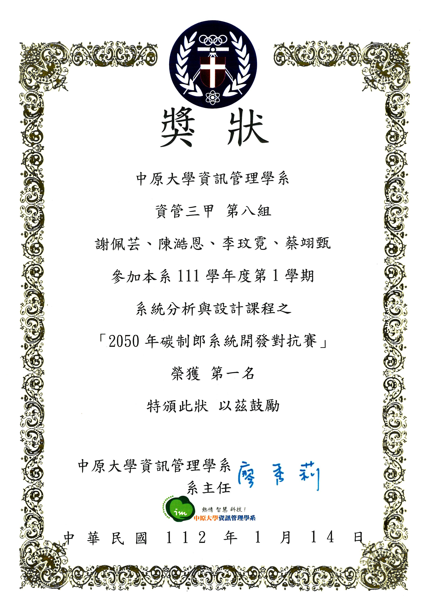
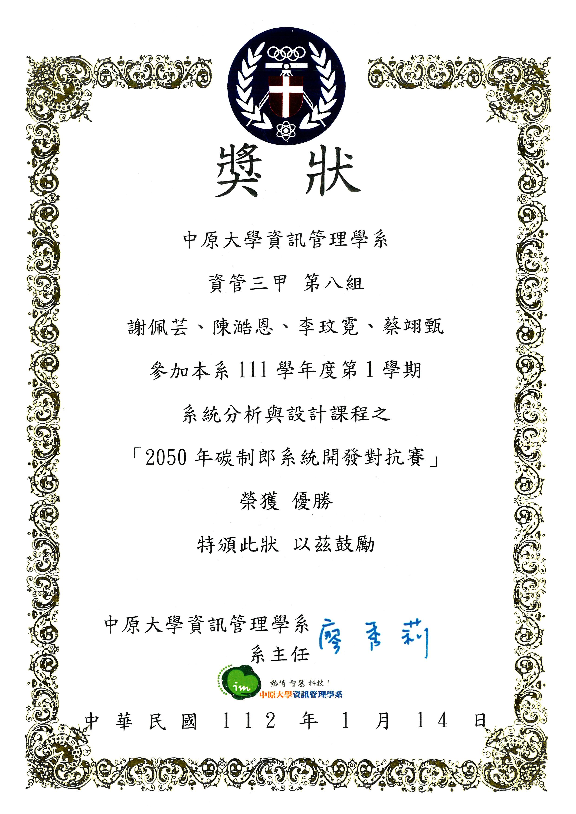
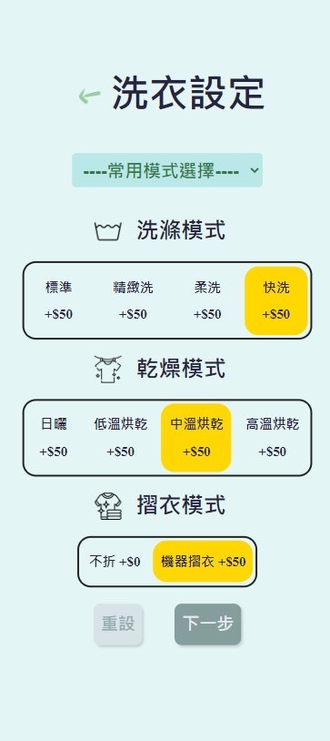

# AI智慧洗衣服務 第八組

模擬未來集中化洗衣和外送自取服務

#### 功能：
- 預約洗衣
- 寵物洗衣
- 點數累計
- 自取/外送 取衣流程
- 外送員接單系統

## 心得
在競賽中，以我一人編寫此專案的後端，並且同時單獨開發[中心資料交換API伺服器](https://github.com/hank1224/SA_ClientCenter)的情況下，

還獲得了年級第一名。這一過程非常辛苦，但也是難得的經驗。

## Awards
- 系統分析課程競賽 年級第一名
- 系統分析課程競賽 甲乙班對決優勝

    
    

## 實機畫面

## Contributors

### 資管三甲 依學號排列

- 10944115 [蔡翊甄](https://github.com/10944115)
- 10944134 [陳澔恩](https://github.com/hank1224)
- 10944145 [謝佩芸](https://github.com/ShiitakePilz)
- 10944146 [李玟霓](https://github.com/10944146)